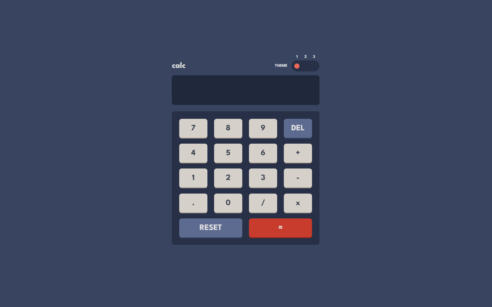

# Calculator app solution

## Table of contents

- [Calculator app solution](#calculator-app-solution)
  - [Table of contents](#table-of-contents)
  - [Overview](#overview)
    - [The challenge](#the-challenge)
    - [Screenshot](#screenshot)
    - [Links](#links)
  - [My process](#my-process)
    - [Built with](#built-with)
    - [What I learned](#what-i-learned)
  - [Author](#author)

## Overview

### The challenge

Users should be able to:

- See the size of the elements adjust based on their device's screen size
- Perform mathmatical operations like addition, subtraction, multiplication, and division
- Adjust the color theme based on their preference
- **Bonus**: Have their initial theme preference checked and have any additional changes saved in the browser

### Screenshot

### Links

- Solution URL: [Github Repository](https://github.com/shadazls/Calculator-app)
- Live Site URL: [Live Site](https://shadazls.github.io/Calculator-app/)

## My process

### Built with

- Semantic HTML5 markup
- CSS custom properties
- Flexbox
- CSS Grid
- Desktop-first workflow

### What I learned

- Storing information in the local storage of a browser
- Theming a web app

## Author

- Website - [Shad Azuelos](https://shadazls.github.io/)
